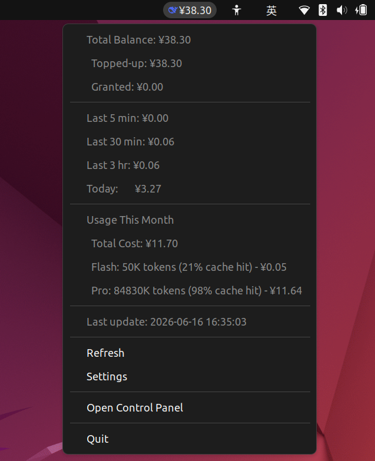
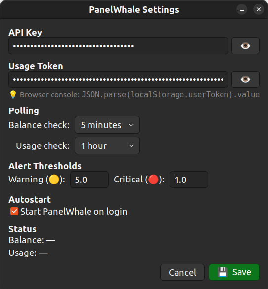

# 🐋 PanelWhale

<p align="center">
  
  
  
  
</p>

一款轻量级 Ubuntu 桌面应用，在顶部状态栏显示 [DeepSeek](https://platform.deepseek.com) API 余额与用量，支持消耗统计、余额告警、模型级 Token 分析、交互式控制面板和 GTK 设置窗口。同时适配 Windows 系统。

本项目基于 [DeepSeekMonitor](https://github.com/JayHome137/DeepSeekMonitor) 及 [DeepSeekMonitorWindows](https://github.com/Joyi-code/DeepSeekMonitorWindows) 项目改进。同时为 Ubuntu/Windows 适配，提供更丰富的功能和更友好的用户体验。

## ✨ 功能特性

- **状态栏常驻** — Ubuntu 顶部状态栏 / Windows 托盘直接显示余额，一目了然
- **用量统计** — 配置 Usage Token 后，右键菜单/展开菜单显示本月总费用及 Flash / Pro 模型 Token 量、缓存命中率
- **右键菜单** — 查看余额明细、近期消耗、今日累计、本月用量
- **控制面板** — 包含余额、模型用量、缓存命中堆叠柱状图、日/小时消耗折线图、Flash / Pro 详情页
- **设置管理** — 点击 Settings 配置 API Key、Usage Token、轮询间隔、告警阈值、开机自启
- **本地存储** — 会话消费 JSON 存储，重启后自动恢复今日累计
- **systemd 托管** — 不依赖终端、崩溃自动重启、开机自启
- **资源友好** — 约 80MB 内存，空闲 CPU 使用率为零
- **余额告警** — ≤¥5 显示🟡、≤¥1 显示🔴；跨阈值弹出桌面通知
- **快捷充值** — 余额低时菜单出现 Charge 按钮，一键跳转 DeepSeek 充值页

## 安装

### Ubuntu
```bash
cd PanelWhale
chmod +x install.sh
./install.sh
```

安装脚本后会引导配置 DeepSeek API Key，并启用开机自启。
> `sudo` 仅用于安装系统包。程序本身以普通用户身份运行。     

### Windows
 [Releases](https://github.com/stephenzhang0529/PanelWhale/releases) 提供了所需的 `.exe` 安装包。

## 配置
### Ubuntu
可通过右键菜单 → **Settings** 在图形界面中修改。      
也可编辑配置文件 `~/.config/panelwhale/config.yaml`：

```yaml
api_key: "sk-your-api-key-here"

# Usage Token（可选）— 登录 platform.deepseek.com 后在浏览器控制台执行：
#   JSON.parse(localStorage.userToken).value
usage_token: ""

poll_interval_seconds: 300          # 余额轮询间隔（秒），最小 30
usage_poll_interval_seconds: 3600   # 用量轮询间隔（秒），最小 600
alert_threshold_yellow: 5.0         # ≤5 元 → 黄色告警
alert_threshold_red: 1.0            # ≤1 元 → 红色告警
```

或使用环境变量：`DEEPSEEK_API_KEY`、`DEEPSEEK_USAGE_TOKEN`。改配置后重启：

```bash
systemctl --user restart panelwhale
```
### Windows
可编辑配置文件 `%APPDATA%\PanelWhale\config.yaml`


## 使用
### Ubuntu 面板
#### 顶部状态栏常驻显示及右键菜单

#### 控制面板（Open Control Panel）

#### 设置面板（Settings）



### Windows 托盘
- **鼠标悬停** — 显示余额和今日消费提示
- **左键单击** — 在浏览器中打开控制面板
- **右键单击** — 展开菜单（余额详情、刷新、充值、设置、退出）


## 项目结构

```
PanelWhale/
├── main.py                          # 入口，平台检测 & 调度
├── config.yaml                      # 示例配置文件
├── panelwhale.spec                  # PyInstaller 打包配置
├── install.sh / uninstall.sh        # Ubuntu 安装/卸载脚本
├── systemd/
│   └── panelwhale.service           # systemd 用户服务
├── scripts/
│   ├── generate_fake_data.py        # 生成测试用假数据
│   └── test_balance_display.py      # 测试余额指示器颜色
└── monitor/
    ├── config.py                    # 配置加载 / 保存 + 平台路径
    ├── api.py                       # DeepSeek 余额 API 客户端
    ├── usage_api.py                 # 平台用量 / 费用 API 客户端
    ├── usage_cache.py               # 用量数据持久化缓存
    ├── store.py                     # 余额历史 + 会话日志
    ├── indicator.py                 # Ubuntu 面板图标、菜单、通知
    ├── windows_tray.py              # Windows 系统托盘指示器
    ├── report.py                    # 日消费汇总存储
    ├── panel.py                     # 控制面板 HTML 生成器
    ├── settings.py                  # GTK 设置窗口（Ubuntu）
    ├── panel_template.html          # 控制面板 HTML 模板（中/EN i18n）
    └── deepseek-color.png           # DeepSeek Logo 图标
```

## 许可证

MIT
