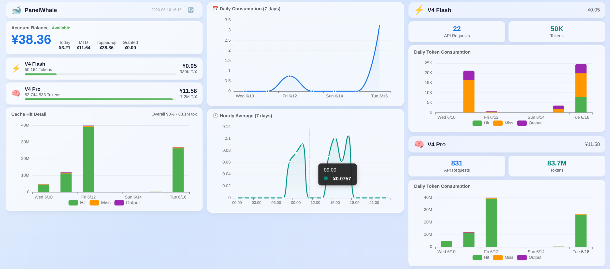

# 🐋 PanelWhale

<p align="center">
  
  
  
  
</p>

一款轻量级跨平台桌面应用，在状态栏/系统托盘显示 [DeepSeek](https://platform.deepseek.com) API 余额与用量，支持消耗统计、余额告警、模型级 Token 分析、交互式控制面板和设置管理。

- **Ubuntu** — 顶部状态栏面板图标（AppIndicator3 + GTK）
- **Windows** — 系统托盘图标，任务栏直接显示余额文字（像鲁大师）

本项目基于 [DeepSeekMonitor](https://github.com/JayHome137/DeepSeekMonitor) 及 [DeepSeekMonitorWindows](https://github.com/Joyi-code/DeepSeekMonitorWindows) 项目改进。

## ✨ 功能特性

- **状态栏常驻** — Ubuntu 面板 / Windows 托盘直接显示余额，一目了然
- **任务栏文字** — Windows 上像鲁大师一样在任务栏显示彩色余额数字，绿色/黄色/红色直观反映余额状态
- **用量统计** — 配置 Usage Token 后，右键菜单/展开菜单显示本月总费用及 Flash / Pro 模型 Token 量、缓存命中率
- **右键菜单** — 查看余额明细、近期消耗、今日累计、本月用量
- **控制面板** — 交互式 3 列 HTML 仪表盘，支持中/英文切换，包含余额卡片、模型用量行、缓存命中堆叠柱状图、日/小时消耗折线图、Flash / Pro 详情页
- **设置管理** — Ubuntu: GTK 图形化界面；Windows: 点击 Settings 直接打开配置文件编辑
- **本地存储** — 会话消费 JSON 存储，重启后自动恢复今日累计
- **资源友好** — 约 80MB 内存，空闲 CPU 使用率为零
- **余额告警** — ≤¥5 显示黄/🟡、≤¥1 显示红/🔴；跨阈值弹出桌面通知
- **快捷充值** — 余额低时菜单出现 Charge 按钮，一键跳转 DeepSeek 充值页

## 安装

### Ubuntu

```bash
cd PanelWhale
chmod +x install.sh
./install.sh
```

安装脚本自动完成：
1. 检测 Ubuntu 版本并安装系统依赖
2. 复制程序到 `/opt/panelwhale/`
3. 引导配置 DeepSeek API Key
4. 安装 systemd 服务并启用开机自启
5. 立即启动

> `sudo` 仅用于安装系统包。程序本身以普通用户身份运行。

### Windows

**方式一：下载预构建 EXE**

从 [Releases](https://github.com/Populus/PanelWhale/releases) 下载 `PanelWhale.exe`，双击运行即可。

**方式二：从源码构建**

```powershell
cd PanelWhale
.venv\Scripts\pip install -r requirements.txt
.venv\Scripts\python -m PyInstaller --clean panelwhale.spec
# 输出: dist\PanelWhale.exe
```

> 构建前需要 Python 3.8+ 和 `pip install pystray Pillow pywin32 pyinstaller pyyaml requests`。

首次运行时系统托盘图标可能在 Windows 11 的溢出区域（点击 `^` 箭头可见），可手动拖到可见区域。

## 配置

配置文件位置：

| 平台 | 路径 |
|------|------|
| Ubuntu | `~/.config/panelwhale/config.yaml` |
| Windows | `%APPDATA%\PanelWhale\config.yaml` |

```yaml
api_key: "sk-your-api-key-here"

# Usage Token（可选）— 登录 platform.deepseek.com 后在浏览器控制台执行：
#   JSON.parse(localStorage.userToken).value
usage_token: ""

poll_interval_seconds: 300          # 余额轮询间隔（秒），最小 30
usage_poll_interval_seconds: 3600   # 用量轮询间隔（秒），最小 600
alert_threshold_yellow: 5.0         # ≤5 元 → 黄色告警
alert_threshold_red: 1.0            # ≤1 元 → 红色告警
```

或使用环境变量：`DEEPSEEK_API_KEY`、`DEEPSEEK_USAGE_TOKEN`。

### Usage Token 获取

Usage Token 和 API Key 是两个不同的凭证：

| | API Key | Usage Token |
|---|---|---|
| 用途 | 查询余额 | 查询用量详情（模型级 Token/费用） |
| 来源 | platform 后台 → API Keys | 浏览器登录后的 localStorage |
| 必填 | **是** | 否 |

获取步骤：
1. 浏览器打开 https://platform.deepseek.com 并登录
2. 按 `F12` → **Console**（控制台）标签
3. 执行 `JSON.parse(localStorage.userToken).value`
4. 输出的字符串即为 Usage Token，填入配置文件

配置了 Usage Token 后，控制面板会多出：模型用量行、缓存命中详情图、Flash/Pro 单模型日消耗图。

Ubuntu 改配置后重启：
```bash
systemctl --user restart panelwhale
```

## 使用

### Windows 托盘
- **鼠标悬停** — 显示余额和今日消费提示
- **左键单击** — 在浏览器中打开控制面板
- **右键单击** — 展开菜单（余额详情、刷新、充值、设置、退出）

### Ubuntu 面板
- **左键单击** — 展开右键菜单
- **Settings** — GTK 图形化设置窗口

### 控制面板


控制面板右上角有 `中` / `EN` 语言切换按钮，支持中文和英文界面。

## 项目结构

```
PanelWhale/
├── main.py                          # 入口，平台检测 & 调度
├── config.yaml                      # 示例配置文件
├── panelwhale.spec                  # PyInstaller 打包配置
├── install.sh / uninstall.sh        # Ubuntu 安装/卸载脚本
├── systemd/
│   └── panelwhale.service           # systemd 用户服务
├── scripts/
│   ├── generate_fake_data.py        # 生成测试用假数据
│   └── test_balance_display.py      # 测试余额指示器颜色
└── monitor/
    ├── config.py                    # 配置加载 / 保存 + 平台路径
    ├── api.py                       # DeepSeek 余额 API 客户端
    ├── usage_api.py                 # 平台用量 / 费用 API 客户端
    ├── usage_cache.py               # 用量数据持久化缓存
    ├── store.py                     # 余额历史 + 会话日志
    ├── indicator.py                 # Ubuntu 面板图标、菜单、通知
    ├── windows_tray.py              # Windows 系统托盘指示器
    ├── report.py                    # 日消费汇总存储
    ├── panel.py                     # 控制面板 HTML 生成器
    ├── settings.py                  # GTK 设置窗口（Ubuntu）
    ├── panel_template.html          # 控制面板 HTML 模板（中/EN i18n）
    └── deepseek-color.png           # DeepSeek Logo 图标
```

## 许可证

MIT
